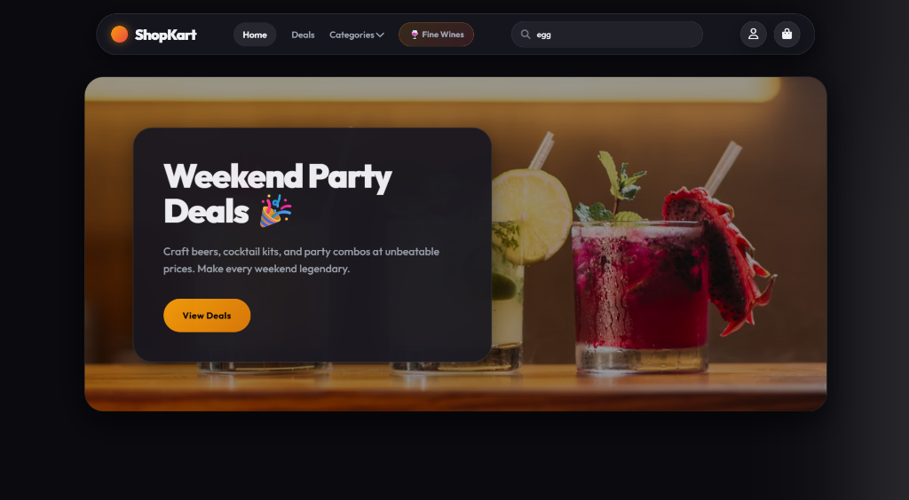
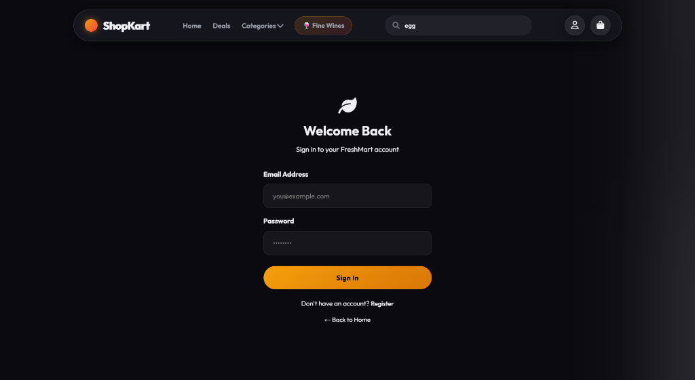
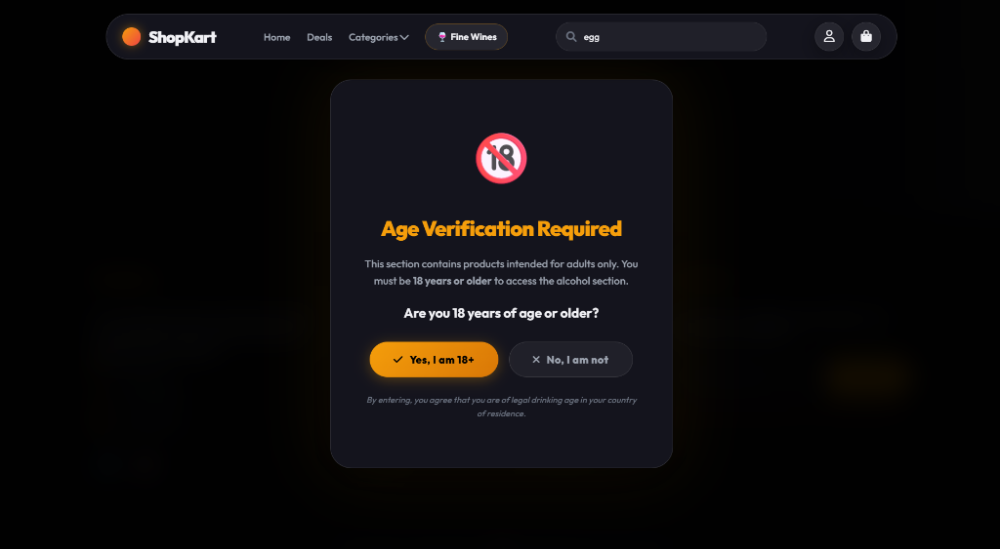

<p align="center">
  
</p>

<h1 align="center">🛒 ShopKart</h1>

<p align="center">
  <strong>A modern, full-stack online grocery &amp; liquor shopping platform</strong><br/>
  Built with React, Node.js, Express &amp; MongoDB
</p>

<p align="center">
  
  
  
  
  
</p>

---

## 📸 Screenshots

### 🏠 Home Page — Hero Slider
> A visually rich hero section with rotating promotional banners, weekend party deals, and a call-to-action for shoppers.



### 🔥 Special Offers & Deals
> Flash sale countdown timer, deal category filters (Discount, Bundle, Flash, Weekend, New), and attractive product deal cards.


### 🔐 Login Page
> Clean, dark-themed sign-in form with email & password fields, register link, and back-to-home navigation.



### 🔞 Age Verification Gate
> Age verification modal for the Fine Wines section — ensures users confirm they are 18+ before accessing alcohol products.



---

## ✨ Features

### 🛍️ Shopping Experience
- **Hero Slider** — Auto-rotating promotional banners with smooth transitions
- **Product Catalog** — Browse products by categories (Fruits, Vegetables, Dairy, Snacks, Beverages, etc.)
- **Search** — Real-time product search with instant results
- **Deals & Offers** — Flash sales with countdown timer, bundle deals, weekend specials
- **Category Filtering** — Filter deals by type: Discount, Bundle, Flash, Weekend, New

### 🍷 Fine Wines Section
- **Age Verification Gate** — Modal popup requiring 18+ age confirmation
- **Dedicated Wine Catalog** — Separate browsing experience for wine & alcohol products

### 🔐 Authentication & Accounts
- **User Registration & Login** — Secure sign-up and sign-in with email & password
- **JWT Authentication** — Token-based session management
- **Password Hashing** — Bcrypt-powered password security
- **User Account Page** — View profile and order history

### 🛒 Cart & Orders
- **Add to Cart** — Add/remove products with quantity management
- **Order Placement** — Checkout flow with order confirmation
- **Order History** — Track past orders from the account page

### 🎨 UI/UX
- **Dark Theme** — Premium dark mode design throughout
- **Responsive Layout** — Works seamlessly on desktop and mobile
- **Micro-animations** — Smooth hover effects, transitions, and interactive elements
- **Modern Navbar** — Sticky navigation with category dropdowns, search bar, and cart icon

---

## 🛠️ Tech Stack

### Frontend
| Technology | Purpose |
|---|---|
| **React 18** | UI component library |
| **Vite 6** | Build tool & dev server |
| **React Router DOM v6** | Client-side routing & navigation |
| **Vanilla CSS** | Custom styling with dark theme, animations, glassmorphism |
| **JavaScript (ES Modules)** | Application logic |

### Backend
| Technology | Purpose |
|---|---|
| **Node.js** | Server runtime |
| **Express.js** | REST API framework |
| **MongoDB** | NoSQL database |
| **Mongoose** | MongoDB ODM (Object Data Modeling) |
| **JWT (jsonwebtoken)** | Authentication tokens |
| **bcryptjs** | Password hashing |
| **dotenv** | Environment variable management |
| **CORS** | Cross-Origin Resource Sharing |

### DevOps & Tooling
| Technology | Purpose |
|---|---|
| **Vercel** | Frontend deployment |
| **Railway** | Backend deployment |
| **Nodemon** | Auto-restart dev server |
| **Git** | Version control |

---

## 📁 Project Structure

```
Shopkart/
├── frontend/                  # React + Vite frontend
│   ├── src/
│   │   ├── components/        # Reusable UI components
│   │   │   ├── AgeGate.jsx        # 18+ age verification modal
│   │   │   ├── CategoryCard.jsx   # Category display card
│   │   │   ├── Footer.jsx         # Site footer
│   │   │   ├── Header.jsx         # Page header
│   │   │   ├── HeroSlider.jsx     # Promotional banner slider
│   │   │   ├── Layout.jsx         # Page layout wrapper
│   │   │   ├── Navbar.jsx         # Navigation bar
│   │   │   └── ProductCard.jsx    # Product display card
│   │   ├── pages/             # Route pages
│   │   │   ├── Home.jsx           # Landing page
│   │   │   ├── Login.jsx          # Sign in / Register
│   │   │   ├── Cart.jsx           # Shopping cart
│   │   │   ├── Offers.jsx         # Deals & offers
│   │   │   ├── Wines.jsx          # Fine wines catalog
│   │   │   ├── Search.jsx         # Search results
│   │   │   ├── CategoryPage.jsx   # Category products
│   │   │   └── Account.jsx        # User account
│   │   ├── context/           # React context providers
│   │   ├── data/              # Static data & assets
│   │   ├── utils/             # Utility functions
│   │   ├── App.jsx            # Root app component
│   │   ├── main.jsx           # Entry point
│   │   └── index.css          # Global styles
│   ├── vite.config.js         # Vite configuration
│   ├── vercel.json            # Vercel deployment config
│   └── package.json
│
├── backend/                   # Node.js + Express API
│   ├── models/                # Mongoose schemas
│   │   ├── User.js                # User model
│   │   ├── Product.js             # Product model
│   │   └── Order.js               # Order model
│   ├── routes/                # API route handlers
│   │   ├── auth.js                # Auth routes (login/register)
│   │   ├── products.js            # Product CRUD routes
│   │   ├── cart.js                # Cart routes
│   │   ├── orders.js              # Order routes
│   │   └── offers.js              # Offers routes
│   ├── middleware/             # Express middleware
│   ├── server.js              # Express server entry
│   ├── seed.js                # Database seeder
│   ├── railway.json           # Railway deployment config
│   └── package.json
│
├── screenshots/               # App screenshots
└── README.md
```

---

## 🚀 Getting Started

### Prerequisites
- **Node.js** v18+
- **MongoDB** (local or Atlas cloud)

### Installation

1. **Clone the repository**
   ```bash
   git clone https://github.com/Arpan1123/Shopkart.git
   cd Shopkart
   ```

2. **Setup Backend**
   ```bash
   cd backend
   npm install
   ```
   Create a `.env` file in `/backend`:
   ```env
   MONGO_URI=your_mongodb_connection_string
   JWT_SECRET=your_jwt_secret
   PORT=5000
   ```

3. **Seed the Database**
   ```bash
   npm run seed
   ```

4. **Setup Frontend**
   ```bash
   cd ../frontend
   npm install
   ```

5. **Run the App**

   Start the backend:
   ```bash
   cd backend
   npm run dev
   ```

   Start the frontend (in a new terminal):
   ```bash
   cd frontend
   npm run dev
   ```

6. Open **http://localhost:5173** in your browser 🎉

---

## 📝 License

This project is open source and available under the [MIT License](LICENSE).

---

<p align="center">
  Made with ❤️ by <a href="https://github.com/Arpan1123">Arpan</a>
</p>